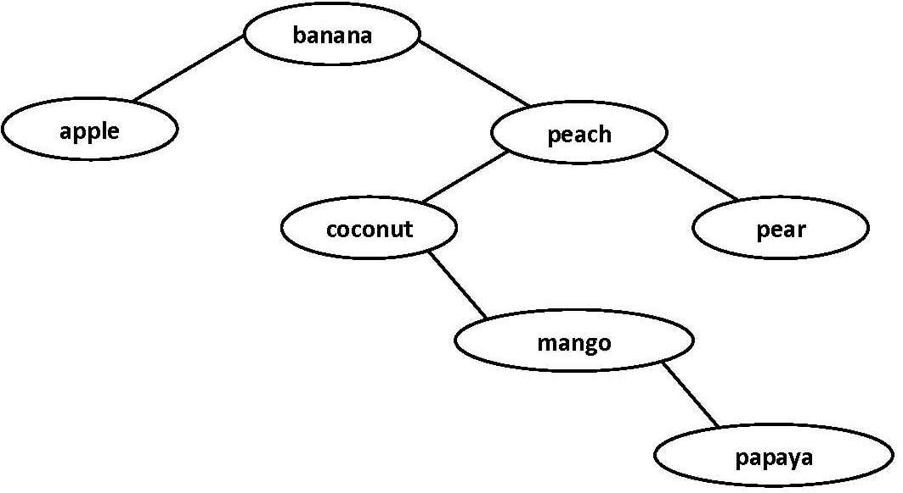
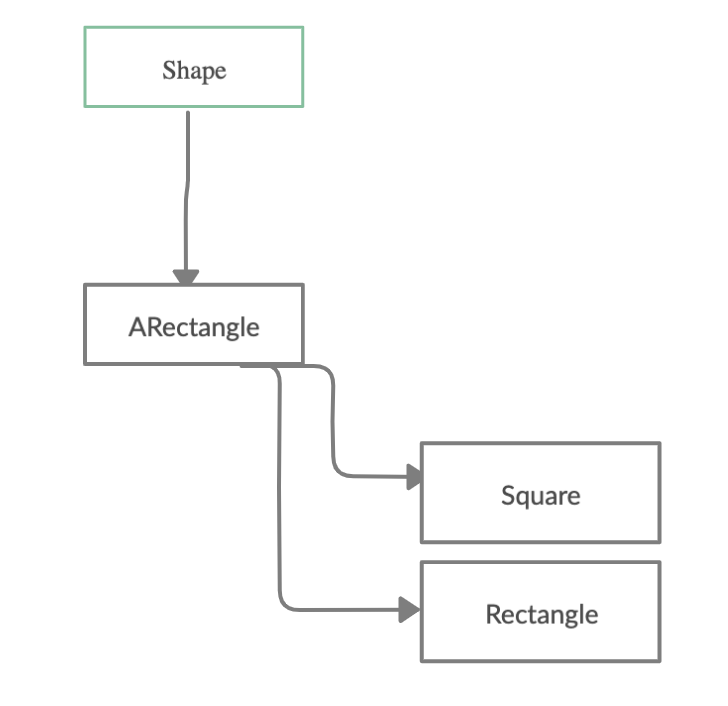
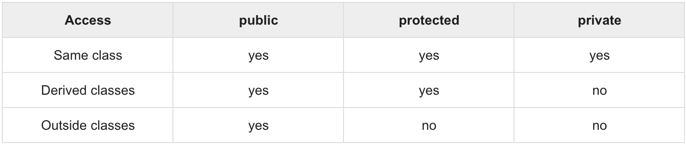

# Binary Search Trees
### Chapters 4 and 12 of _Data Structures and Algorithm Analysis in C++_

## The Motivation
Even though hashing gives us super fast lookups and insertions, there is one major flaw:
the data is not sorted.

Thinking back to lists and arrays, we saw that if our data is sorted, we can perform searches and insertions in logarithmic time by making use of the idea of binary search. Let's revisit that idea now.

## Sets, Maps, and The Tree Data Structure
As we saw last lecture, the Set and Map ADTs are useful abstractions related to their mathematical counterparts.

The data structures of a Hashset and Hashmap provide nice quick insertion and lookup, but as we've hinted to above, provide no guarantees about ordering.

## Binary Trees vs Binary Search Trees
There are many kinds of trees used in different contexts, but we'll focus on binary trees.

A **binary tree** is a recursively defined data structure composed of nodes, with one node serving as the "root node".

In a binary tree, every node maintains the invariant that it has [0, 3) children. The "recursive" part of the definition is that each node in a binary tree serves as the "root" of its own binary tree.


A **binary search tree** (BST) is a binary tree that has a couple extra constraints:
1. Every element appears at most one time in the tree (making it a good candidate to use to implement sets).
2. At any and every node, every in its left subtree is smaller than it in value, and every node in its right subtree is larger than it in value.



Binary search trees are good candidates for implementing sets and maps, and in an optimally balanced tree, we have guaranteed `O(log n)` time operations (lookup, insert, remove), where `n` is the number of elements.

However, if the tree is unbalanced enough, we end up with a sorted linked list and regress back to `O(n)` time operations where `n` is the number of elements.

## Using the Tree: Traversals
In order to gain value from the sorted property, we must be able to use the tree in a way that takes advantage of its properties.

In a **traversal**, we walk through the tree node by node until we've visted every tree.

We'll discuss four main kinds of traversals, though others exist. For each traversal, *V* means we "visit" (i.e. do something), *L* means we recursively go to the left child of our current node, and *R* means we recursively go to the right child of our current node.

1. **Pre-Order Traversal**
   * This traversal has the order **V,L,R**.
   * This one is useful for cloning a tree, since it gives you back the nodes in the same places that they are currently inserted.
2. **In-Order Traversal**
   * This traversal has the order **L,V,R**.
   * This one is useful for printing a tree in sorted order.
   * By going **R,V,L**, you visit each node in reverse sorted order.
3. **Post-Order Traversal**
   * This traversal has the order **L,R,V**
   * This one is useful for implementing destructors since it works its way from the bottom levels back up to the top.
4. **Level-Order Traversal**
   * This traversal makes use of a technique known as breadth-first search to visit each level of the tree one by one.
   * It uses a queue to get this iterative deepening style traversal.

These traversals are trivially implemented recursively (as are most tree functions), but can be done iteratively as well with a lot more time and effort.

Next lecture, we'll implement a basic binary search tree, but for now, let's talk about C++.

## C++ Feature: Class Access Modifiers
C++, like Java and C#, features access modifiers for their classes. The ones offered are `public`, `private`, and `protected`.

Unlike Java and C#, C++ does it with sections instead of on a per method/field basis. A C++ class can have as many sections of each as desired, with different things in each.

In C++, classes default to `private` until switched over, and structs default to `public` until switched over.

As an example, in Java we'd have:
```java
public class Ex {
  private Inner in;
  public boolean boo;
  protected int ex;
  private class Inner {
    private String s;
    private Inner(String s) {
      this.s = new String(s);
    }
  }
  public Ex(int ex, String s) {
    this.boo = false;
    this.ex = ex;
    this.in = new Inner(s);
  }
}
```

The same class in C++ would look like:

```cpp
class Ex {
 protected:
  int ex;
 private:
  class Inner {
    std::string s;
    Inner(const std::string & s) {
      this->s = s;
    }
  };
  Inner *in;
 public:
  bool boo;
  Ex(int ex, const std::string & s) {
    this->boo = false;
    this->ex = ex;
    this->in = new Inner(s);
  }
  ~Ex(void) {
    delete this->in;
  }
};
```

Great, but what do these modifiers mean?

1. `public`
   * `public` fields are accessible/viewable from anywhere within the program. This means that non-member methods or objects can access and change `public` fields of other objects without accessor or mutator methods (getters and setters).
   * In general, making fields `public` is not recommended and is a sign of bad encapsulation.
2. `private`
   * `private` fields are accessible/viewable only from within the class itself or from `friend` functions/classes.
   * In general, we make data `private` and provide `public` accessor and mutator methods for other code to use to be able to manipulate the data.
3. `protected`
   * `protected` fields are like private fields in that they're only accessible/viewable from within the class itself or from `friend` functions/classes, but they have the added benefit of being visible from subclasses (which we'll talk about next).

## C++ Feature: Inheritance
In object-oriented languages, the concept of <a href="https://en.wikipedia.org/wiki/Inheritance_(object-oriented_programming)" target="_blank">Inheritance</a> is the subject of much debate.

Most languages that are object-oriented support this in some way, but we'll look at how Java and C++ do it.

Inheritance usually goes hand in hand with subtyping to create an "is-a" relationship (compared to how composition created "has-a" relationships.)

For example, a Car "is-a" Vehicle, and a Car "has-a" steering wheel. The car is "composed" up of other parts, but is a subtype of a Vehicle.

*Note: Java has interfaces and C++ does not, but for today we're gonna ignore those and focus on abstract classes.*

```java
public class Point {
  private int x,y;
  public Point() {
    this.setX(0);
    this.setY(0);
  }
  public Point(int x, int y) {
    this.setX(x);
    this.setY(y);
  }
  public Point(Point p) {
    this.setX(p.getX());
    this.setY(p.getY());
  }
  public int getX() {
    return this.x;
  }
  public int getY() {
    return this.y;
  }
  private void setX(int x) {
    this.x = x;
  }
  private void setY(int y) {
    this.y = y;
  }
  public void move(int dx, int dy) {
    this.setX(this.getX() + dx);
    this.setY(this.getY() + dy);
  }
}

public abstract class Shape {
  private String name;
  public Shape() {
    this.setName(new String());
  }
  public Shape(String name) {
    this.setName(new String(name));
  }
  public String getName() {
    return this.name;
  }
  private void setName(String name) {
    this.name = name;
  }
  // all subclasses must implement this function
  public abstract void move(int dx, int dy);
}
public abstract class ARectangle extends Shape {
  private Point upperLeft;
  public ARectangle() {
    super("ARectangle");
    this.setUpperLeft(new Point());
  }
  public ARectangle(String name, int x, int y) {
    super(new String(name));
    this.setUpperLeft(new Point(x, y));
  }
  public ARectangle(String name, Point upperLeft) {
    super(new String(name));
    this.setUpperLeft(new Point(upperLeft));
  }
  public ARectangle(ARectangle r) {
    super(new String(r.getName()));
    this.setUpperLeft(new Point(r.getUpperLeft()));
  }
  public Point getUpperLeft() {
    return this.upperLeft;
  }
  private void setUpperLeft(Point p) {
    this.upperLeft = p;
  }
  @Override
  public void move(int dx, int dy) {
    this.getUpperLeft().move(dx, dy);
  }
}
public class Rectangle extends ARectangle {
  private int width, height;
  public Rectangle() {
    super("Rectangle", 0, 0);
    this.setWidth(0);
    this.setHeight(0);
  }
  public Rectangle(int x, int y, int width, int height) {
    super("Rectangle", x, y);
    this.setWidth(width);
    this.setHeight(height);
  }
  public Rectangle(Point upperLeft, int width, int height) {
    super("Rectangle", upperLeft);
    this.setWidth(width);
    this.setHeight(height);
  }
  public Rectangle(Rectangle r) {
    super(r);
    this.setWidth(r.getWidth());
    this.setHeight(r.getHeight());
  }
  public int getWidth() {
    return this.width;
  }
  public int getHeight() {
    return this.height;
  }
  private void setWidth(int width) {
    this.width = width;
  } 
  private void setHeight(int height) {
    this.height = height;
  }
}
public class Square extends ARectangle {
  private int side;
  public Square() {
    super("Square", 0, 0);
    this.setSide(0);
  }
  public Square(int x, int y, int side) {
    super("Square", x, y);
    this.setSide(side);
  }
  public Square(Point upperLeft, int side) {
    super("Square", upperLeft);
    this.setSide(side);
  }
  public Square(Square s) {
    super(s);
    this.setSide(s.getSide());
  }
  public int getSide() {
    return this.side;
  }
  private void setSide(int side) {
    this.side = side;
  }
}
```

A lot of code, I know, but what we've set up is this diagram:


The `Point` class is used with "composition" inside of the other classes, which is why it isn't on the diagram.

Let's now look at the same classes in C++!

```cpp
class Point {
  int x, y;
  void setX(int x) {
    this->x = x;
  }
  void setY(int y) {
    this->y = y;
  }
 public:
  Point(void) {
    this->setX(0);
    this->setY(0);
  }
  Point(int x, int y) {
    this->setX(x);
    this->setY(y);
  }
  Point(const Point & point) {
    this->setX(point.getX());
    this->setY(point.getY());
  }
  int getX(void) const {
    return this->x;
  }
  int getY(void) const {
    return this->y;
  }
  void move(int dx, int dy) {
    this->setX(this->getX() + dx);
    this->setY(this->getY() + dy);
  }
};
class Shape {
  std::string name;
  void setName(const std::string & name) {
    this->name = name;
  }
 public:
  Shape(void) {
    this->setName(std::string(""));
  }
  Shape(const std::string & name) {
    this->setName(name);
  }
  std::string getName(void) const {
    return this->name;
  }
  // abstract method in c++
  // they're called "pure virtual functions"
  virtual void move(int dx, int dy) = 0;
};
class ARectangle : public Shape {
  Point *upperLeft;
  void setUpperLeft(Point *upperLeft) {
    this->upperLeft = upperLeft;
  }
 public:
  Point *getUpperLeft(void) const {
    return this->upperLeft;
  }
  ARectangle(void) : Shape("ARectangle") {
    this->setUpperLeft(new Point());
  }
  ARectangle(std::string & name, int x, int y) : Shape(name) {
    this->setUpperLeft(new Point(x, y));
  }
  ARectangle(std::string & name, Point *upperLeft) : Shape(name) {
    this->setUpperLeft(new Point(*upperLeft));
  }
  ARectangle(ARectangle & r) : Shape(r.getName()) {
    this->setUpperLeft(new Point(r.getUpperLeft()));
  }
  virtual ~ARectangle(void) {
    delete this->upperLeft;
  }
  void move(int dx, int dy) override {
    this->getUpperLeft()->move(dx, dy);
  }
};
class Rectangle : public ARectangle {
  int width, height;
  void setHeight(int height) {
    this->height = height;
  }
  void setWidth(int width) {
    this->width = width;
  }
 public:
  int getWidth(void) const {
    return this->width;
  }
  int getHeight(void) const {
    return this->height;
  }
  Rectangle(void) : ARectangle("Rectangle", 0, 0) {
    this->setWidth(0);
    this->setHeight(0);
  }
  Rectangle(int x, int y, int width, int height) : ARectangle("Rectangle", x, y) {
    this->setWidth(width);
    this->setHeight(height);
  }
  Rectangle(Point *upperLeft, int width, int height) : ARectangle("Rectangle", upperLeft) {
    this->setWidth(width);
    this->setHeight(height);
  }
  Rectangle(Rectangle & r) : ARectangle(r) {
    this->setWidth(r.getWidth());
    this->setHeight(r.getHeight());
  }
};
class Square : public ARectangle {
  int side;
  void setSide(int side) {
    this->side = side;
  }
 public:
  int getSide(void) const {
    return this->side;
  }
  Square(void) : ARectangle("Square", 0, 0) {
    this->setSide(0);
  }
  Square(int x, int y, int side) : ARectangle("Square", x, y) {
    this->setSide(side);
  }
  Square(Point *upperLeft, int side) : ARectangle("Square", upperLeft) {
    this->setSide(side);
  }
  Square(Square & s) : ARectangle(s) {
    this->setSide(s.getSide());
  }
};
```

While the code looks very similar, you may notice a few things:
1. No `super()`. This is because C++ supports multiple inheritance (like using `extends` on more than one class) so any superclass constructors must be called explicitly via the initialization list.
2. Derivations with access rights. All Java derivations are what C++ calls "public" derivations, though C++ supports other kinds as well (we'll get to this).
3. Abstract methods don't have `abstract`. C++ calls them **"pure virtual functions"**, and any class that has one in it becomes an abstract class. A class with only pure virtual functions and public data is what Java would call an **interface**.

Here is a helpful chart explaining how different fields are accessed with different derivation types:


Derived classes inherit all methods from a base class **except**:
1. Constructors, destructors, and copy constructors.
2. Overloaded operators of the base class.
3. `friend` functions/classes of the base class.

In general, if you're gonna do any other kind of derivation other than `public`, you should just use composition instead to get a "has-a" instead of an "is-a" relationship.

That's all folks! Next time, [addressing issues with BSTs and implementing a basic one](./rebalancing.md).

[back](../lectures.md)
