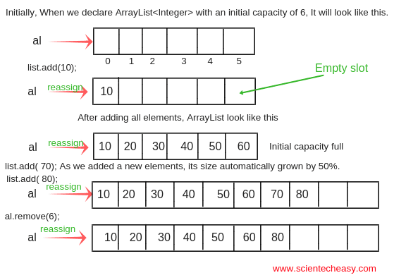

# ArrayLists and Vectors
### Chapter 3 of _Data Structures and Algorithm Analysis in C++_



## The Motivation

Arrays are great.

* Constant time access, insertion, and removal (if you don't shift items down)
* Pretty much every language implements them.
* They work (basically) the same in C++ and Java.

```java
int[] array = {1,2,3,5,7,11};
```

```cpp
int array[] = {1,2,3,5,7,11};
```

*Note: C++ arrays don't know their own length (unlike in Java) so this makes them a bit more annoying to use...*
*The C and C++ libraries deal with this by either having a null value inserted at the end to know when it is reached, or*
*they will pass in the length as another argument.*

Arrays aren't great?

* They don't resize.
* They're not memory safe (segfaults galore if you're not careful)
* *Anything else we don't like about them?*

Let's fix (some of) these problems!

First, resizing. Any ideas for solutions?

Let's build our own, implementing some basic features. Our array will only hold integers for now.

(I'm about to introduce C++ classes right now; don't panic)

```cpp
class MyArray:
 private:
  int *arr; // The array itself
  int size; // Size of the array
  int num_elements; // Number of elements
 public:
  // Default constructor.
  MyArray(void) {
    this->size = 10;
    this->arr = new int[this->size];
    this->num_elements = 0;
  }

  // Constructor that takes the size to make the array
  MyArray(int size) {
    this->size = size;
    this->arr = new int[this->size];
    this->num_elements = 0;
  }
```

## A Quick Aside: C++ Classes

* They're declared using keyword `class`. We'll get into inheritance later.
* `this` is now a pointer, not a reference (like in Java). Pointers "point" to a variable (so they hold a memory location of the variable.)
* Instead of access being on each member (like `private int size` in Java), we get access rights on entire *sections*.

Next up: How should we implement insert?

## Enhancing our class: Insertion

```cpp
class MyArray:
 private:
  int *arr; // The array itself
  int size; // Size of the array
  int num_elements; // Number of elements
 public:
  // Default constructor.
  MyArray(void) {
    this->size = 10;
    this->arr = new int[this->size];
    this->num_elements = 0;
  }

  // Constructor that takes the size to make the array
  MyArray(int size) {
    this->size = size;
    this->arr = new int[this->size];
    this->num_elements = 0;
  }

  void add(int element) {
    this->arr[this->num_elements] = element;
    ++this->num_elements;
  }
```

Easy enough. Now, resizing. How should we do this?

```cpp
class MyArray:
 private:
  int *arr; // The array itself
  int size; // Size of the array
  int num_elements; // Number of elements

  void resize(void) {
    this->size = this->size * 2 + 1;
    int *temp_arr = new int[this->size];
    int index = 0;

    while(index <= this->num_elements) {
      temp_arr[index] = this->arr[index];
      index++;
    }

    delete [] this->arr;
    this->arr = temp_arr;
  }

 public:
  // Default constructor.
  MyArray(void) {
    this->size = 10;
    this->arr = new int[this->size];
    this->num_elements = 0;
  }

  // Constructor that takes the size to make the array
  MyArray(int size) {
    this->size = size;
    this->arr = new int[this->size];
    this->num_elements = 0;
  }

  ~MyArray(void) {
    delete [] this->arr;
  }

  void add(int element) {
    if(this->num_elements == this->size) {
      this->resize();
    }
    this->arr[this->num_elements] = element;
    ++this->num_elements;
  }
```

You'll have to implement delete yourself ;)

The data structure we've implemented has a name: the **ArrayList (Java)/Vector (C++)**

## Another Sidenote: ADTs vs Data Structures

In this class, we'll (mostly) discuss Abstract Data Types (ADTs)
* An ADT outlines a set of behaviors that should be expected, but not how to implement them.
* Implementation can vary wildly, providing the behavior is as expected.

A data structure is a set implementation.
* They are defined in terms of how they are implemented, not behavior.

Think of ADTs as an Interface, and data structures as a class.

Example data structures:
* Arrays, LinkedLists, ArrayLists...

Example Abstract Data Types:
* Binary Search Trees, Stacks, Queues, Heaps, Lists...

Now back to the main content.

## ArrayLists/Vectors

* ArrayLists ([`java.util.ArrayList`](https://docs.oracle.com/javase/8/docs/api/java/util/ArrayList.html)) are a resizable array-like structure that provides constant time access (like regular arrays) but can grow.
* The C++ equivalent (that you will be making in the assignment) is called a Vector ([`std::vector`](http://www.cplusplus.com/reference/vector/vector/?kw=vector))
* By default, Java ArrayLists can hold elements that are not all the same type, but C++ Vectors cannot.

  *side note: Java also has Vectors [`java.util.Vector`](https://docs.oracle.com/javase/8/docs/api/java/util/Vector.html) and the difference is that the Java Vectors are thread-safe while vectors aren't*

* The main functions implemented are: `size` (returns the number of elements), `empty`, `operator[]/at` (access an element),
  `front` (access first element), `back` (access last element), `push_back` (add to end), `pop_back` (remove from end), and
  `insert` (insert at a given position via iterator).
* Other functions include `shrink_to_fit` (make the vector smaller), `max_size`, `resize`, and `capacity`.
* ArrayLists/Vectors are a common implementation of the List ADT, which is, well, a *list* of elements.

What's the runtime of...

`size`? <!--- runtime of size is O(1) --->

`empty`? <!--- runtime of empty is O(1) --->

`operator[]/at` and `front` and `back`? <!--- runtime of this is also O(1) --->

`pop_back`? <!--- runtime of this is O(1) --->

`insert`? <!--- Runtime is linear on the number of elements inserted + number of elements after position --->

`push_back`? <!--- This one they won't get; runtime is O(1) amortized time where a reallocation is linear time up to the size --->


To fully understand the runtime of `push_back`, wait until an advanced algorithms class where *amortization* is discussed. We won't
cover that now :), but you can read about it in chapter 11!

## When should we use a Vector versus an array?

Use an array when...

1. You know the exact number of elements that will be inserted ever or want to limit the number
2. You're writing C++ that may be called from/used by some C code.
3. You have limited memory.
4. You'll have way more accesses than insertions/removals.

Use a vector when...

1. You will be doing a lot of insertions/removals.
2. You don't know how much you'll be holding/you want an "unlimited" container.
3. You want to implement another ADT that also shouldn't have a maximum size.

To summarize, you'll probably end up using vectors a lot.

That's all folks! Next time: [Stacks and Queues](./stacks_queues.md).

[back](../lectures.md)
