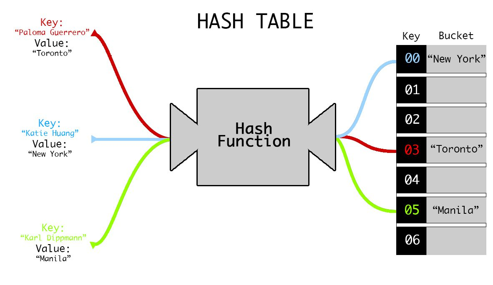

# Introduction to Hashing
### Chapter 5 of _Data Structures and Algorithm Analysis in C++_

## The Motivation
So far, we've looked at lists and arrays for storage.

We know that to find an arbitrary element in an unsorted array or list, it takes `O(n)` time on average where `n` is the number of elements.

Our goal is to go from `O(n)` to `O(1)` time average case. How can we do this?

The idea: take our data, run it through a function, use the output to help us store/locate our data. This gives us, ignoring the computation time for the function itself, a `O(1)` lookup and insert.

## Hashing & Hash Functions
This is the idea of turning some data into a number via a function, called a *hash function*.

This can be done for both cryptography (cryptographic hashing) or for speed (regular hashing).

For non-cryptographic hash functions, there are two main properties:

Given two values *k* and *l* and a hash function *h(x)*:
1. **Property of Equality** (required): if *k* equals *l*, then *h(k)* equals *h(l)*.
   * This property is required since without it, our function becomes useless for searching and puts us back to `O(n)` search.
2. **Property of Inequality** *(optional)*: if *k* does not equal *l*, then *h(k)* does not equal *h(l)*
   * This property guarantees unique hashes, and is nice to have since it leads to perfect optimal `O(1)` search and insertion.

A function that has both of these properties is known as a **perfect hash function**, and are generally hard to come up with. 

(For you mathematicians, a perfect hash function is also known as an injective (or one-to-one) function where each distinct element of the domain maps to one and only one element of the codomain).

  
**Discuss**: Is the function *f(x) = 0* a hash function? Is it perfect?
  

**Answer**: *Yes*! It's just not a useful hash function. It also isn't a perfect hash function.

If you check both properties, you'll see that property 1 is satisfied (making it a hash function), but property 2 is violated, making it not a perfect hash function.

For practical applications, a perfect hash function may not compute any colliding elements, but we're still limited by one main factor: **_memory_**. We bound by the amount of memory, so we'll need to do a modulo (%) to stay in bounds.

This can lead to interesting issues with implementation regarding the tables. If our hash function doesn't distribute well,
we can run into problems with distribution leading to a ton of collisions. One mitigation strategy is using prime numbers for our table sizes (why is this?), while another is making sure our functions are good enough at randomly distributing data. However, this still isn't foolproof.

This means that **even with a perfect hash function, we will still have collisions in practice**. How do we deal with this?

## Collision Resolution Schemes

We'll discuss 4 collision resolution schemes:

1. Open Addressing (Linear Probing)
   * idea: if we hash to a spot that is taken, just walk down the line till we find an empty spot and use that.
   * pros:
     * simple to implement
   * cons:
     * worst case we're back to linear searching
     * can't legitimately remove anything due to the structure of the table
2. Closed Addressing (Separate Chaining)
   * idea: at each index, we store a linked list. If two items hash to the same spot, insert it as a node into the linked list
   * pros:
     * better average runtime than open addressing
     * still pretty simple to implement
   * cons:
     * many items hashing to same spot --> linear searching through a linked list
     * wasted memory
3. Cuckoo Hashing
   * idea: two mirror tables, two *different* hash functions. if the new item hashes to a taken spot, kick out the old one and rehash it into the opposite table. repeat until everything is stable or a cycle is detected.
   * pros:
     * less wasted space than separate chaining and better performance than both above methods.
   * cons:
     * more complex implementation --> easier to mess up
     * hard to detect cycles; need clever algorithm to do so
4. Double Hashing
   * idea: two hash functions used. one gives you initial location, other gives you some increment. use the increment value to search for open spots if a spot is taken.
   * pros:
     * less complex than cuckoo hashing with better performance than other two methods
   * cons:
     * bad choice of hash functions leads to major issues with implementation

### Side Note: Performance
One thing we've seen with all above strategies is that they all become much worse performance wise if the table gets full. This is because as the table fills, collisions become more and more likely due to the modulo operation.

As a result, a common strategy is to resize the table and rehash the elements once a certain threshold is reached to maintain optimal performance. The ratio used to determine this is called **load factor** (# of elements/# of spots).

A common load factor used that straddles the line between costly rehashes and costly lookups is 0.75. The lower the number, the more often the rehashes. The higher, the more often the collisions.

## ADTs and Data Structures
The concept of hashing allows for easy `O(1)` runtimes for the **Set** and **Map** ADTs.

A Set is an abstraction of the mathematical concept, where each item is unique.

A Map is an abstraction where key-value pairs are held, where each key must be unique. The key is used to "map" to its corresponding value.

Sets can be implemented with a Hashtable data structure, and Maps can be implemented with a Hashmap data structure.

Most languages feature support for these structures built into their libraries:
* Python: dictionaries and sets
* Java: `java.util.HashSet` and `java.util.HashMap`
* C++: `std::unordered_set` and `std::unordered_map`

That's all folks! Good luck on your midterm, and next time, [Binary Search Trees](./rebalancing.md)

[back](../lectures.md)
