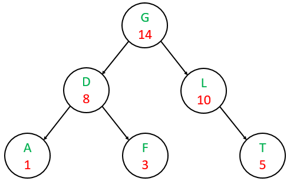

# Heaps and Priority Queues
### Chapter 6 of _Data Structures and Algorithm Analysis in C++_

## The Motivation
Earlier this quarter, we talked about [queues](./stacks_queues.md).
Often, the FIFO nature of a queue is exactly the behavior wanted.
Sometimes though, we don't want FIFO. Here's an example:

You're writing code for a printer, so naturally you want a queue of printer jobs.
What if you have to choose between a 1 page job and a 100 page job? Which would you put first?

What about a 1 page black and white vs a 1 page color? Which would you put first?

In both instances, a regular queue would put whichever arrived first, first (which could be bad
if the first thing was the color or the 100 page job.)

A queue that we could use here is known as a *priority queue*, and it lets us view the item
with the highest priority first in constant time no matter what.

## The Priority Queue ADT

A **priority queue** is an ADT that supports, at a minimum, *push*, *top*, and *pop* operations.

The goal is that you are able to top the element with the highest priority in constant time, but you make no guarantees about the inherent ordering of the rest of the elements.

We *could* technically implement this via a sorted linked list, but this gives us $O(n)$ insertion time for $O(1)$ pop and top time. While this seems okay, we'd like to be able to get better insertion time (at the cost of some pop time).

A better option is to used a BST (or a balanced BST). The former gives us $O(\log n)$ average for all operations, while the latter gives us $O(\log n)$ worst case for all operations.
This is fine, and it works, but we want to get back to $O(1)$ pop time while keeping $O(\log n)$ time for all other operations.

## Implementing a Priority Queue: Heap Data Structure

Often, priority queues are implemented via a **heap** data structure.

*Note: this is not the same "heap" as the area of the C/C++/other languages' runtime environments. You'll learn about that in CSE 30.*

*Another note: Though other kinds of heaps exist, we're only talking here about binary heaps. If you'd like, you can learn about [fibonacci heaps and binomial heaps from this video](https://www.youtube.com/watch?v=gxp_FrgTkQI).*

A *binary heap* is a binary tree with a couple extra properties:
1. **Full Heap Property**
   * Every level, except for maybe the bottom, is fully filled in.
   * The bottom level, if not full, is populated from left to right.
   * This results in a *complete binary tree*
2. **Heap Order Property**
   * For any element, its children have a lower priority than it.

Note that property 2 implies two different flavors of heaps.

**If every node is greater than its children, we have a _max heap._**

**If every node is less than its children, we have a _min heap._**

Is the following heap a min heap, or a max heap?

Is the following heap a min heap, or a max heap?

Because of property 1, implementing a heap via an array is actually pretty easy to do. We can very easily map each index of an array to a child of a node via a few formulas. The book doesn't use index 0 of the array, so their formulas will be different by a factor of 1.

For any index $i$:
* To find the parent
  * using index 0: $(i - 1) / 2$ (**_integer division!_**)
  * not using index 0: $i / 2$ (**_integer division!_**)
* To find the left child
  * using index 0: $(2 \times i) + 1$
  * not using index 0: $(2 \times i) + 2$
* To find the right child
  * using index 0: $(2 \times i) + 2$
  * not using index 0: $(2 \times i) + 1$

#### For all formulas, unsigned integer types should be used to verify that values below 0 are never indexed into.

Here's an example of using an array:

Based on property 2, regardless of which kind of heap, where does the element with the highest priority live in the heap?

<!-- answer: the root -->

Like an AVL tree, any time we modify the structure of the heap via insertion or removal, we run the risk of violating the heap order property.

Fortunately, there are two operations we can perform to remedy this: **bubble up/heapify up** and **trickle down/heapify down**.

### Bubble Up/Heapify Up
In this operation, we swap a node with its parent if the
child node-parent node relationship violates the heap order property.

We can implement this function recursively, making the recursive call if we ended up swapping.

Let's walk through an example together!
<!-- use data structure visualization to do an example -->

When is this operation used?

<!-- answer: when inserting -->

### Trickle Down/Heapify Down
In this operation, we swap a node with one of its two children to ensure that the heap order property is not violated.

We want to make sure that the swap occurs between the parent
and the child node with the highest priority.

This function can also be implemented recursively, where
the recursive call is made if and only if the node we are
swapping does not live in the bottom level already.

Let's walk through an example together!
<!-- use data structure visualization to do an example -->

When is this operation used?

<!-- answer: when removing -->

## Special Sidenote: Revisiting Balanced BSTs

Now that we've learned about heaps, we can revisit one special kind of BST.

One cool data structure we can create is called a *Treap*, and it is a BST where the "keys" are the items to hold and the "priorities" are integers.

In a treap, the keys must follow the BST property, and the values must follow the heap property.

Here is a treap where the priorities are a max heap:

In a treap, we perform insertions first by inserting according to the keys (BST) and fixing priorities according
to the heap order property.

We perform removals in a similar way by first removing according to the keys (BST) and fixing priorities according
to the heap order property.

As it turns out, we can achieve a (relatively) balanced tree by way of randomly generating priorities
as we insert! The analysis for this is somewhat complex, but, it is available [here](http://www.ist.tugraz.at/_attach/Publish/Eaa19/Chapter_05_RandomizedSearchTree_handout.pdf).

In case you're curious, there is source code available for an RST that you can
look at and try out. It's linked <a
href="https://github.com/nate-browne/CSE12_Redesign/blob/master/Lectures/lecturematerials/RST"
target="_blank">here, and comes with a corresponding Makefile.</a>

That's all folks! Next time, we'll talk about [using libraries](./libraries.md)

[back](../lectures.md)
