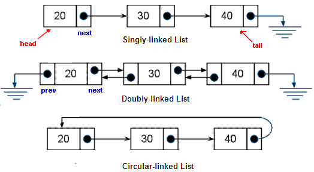

# Linked Lists
### Chapter 3 of _Data Structures and Algorithm Analysis in C++_



## The Motivation

We discussed the List ADT and how that can be used similarly to an array when we talked about [vectors](./arraylists_vectors.md), but there is a major flaw with vectors that we would like to resolve.

Insertion into an arbitrary spot of a vector takes a _considerable_ amount of time. Why is this?
<!-- reason: have to shift each element down and potentially resize the entire backing array-->

This lecture, we'll take a look at another data structure used for implementing the List ADT and see how it differs from the vector implementation.

## Linked Lists

At its core, a linked list is a sequence of connected node objects, each containing some sort of data item (whatever that may be). Depending on the type of list, the nodes may look slightly differently.

The list may contain either (or both) a pointer to the front (head) and a pointer to the end (tail/back) of the list, though commonly lists contain both head and tail pointers for reasons of speed.

### Singly-Linked
In this list, each node contains a pointer only to the next node, with the last node pointing to NULL.

This is the simplest type of linked list, and it only provides one way traversal through the list.

### Doubly-Linked
In this list, each node contains a pointer to both the previous node as well as the next node. The head node's previous pointer points to NULL, as does the tail node's next pointer.

<br>
There are other kinds of specialty lists, too:
<br><br>

### Circular Linked Lists
These can be either singly- or doubly-linked, but the idea is that no pointers point to NULL.

Instead, we have a circle being formed where following going to the tail and following the next pointer takes you back to the head of the list.

### Skip Lists
Technically, these aren't linked lists; they're more like cousins of linked lists.

They rely on probability to provide better than linear time lookup and insertion to any spot in the list.

You can read more about them <a href="https://en.wikipedia.org/wiki/Skip_list" target="_blank">here</a>

Before looking at implementation, let's discuss a feature of OOP: <a href="https://en.wikipedia.org/wiki/Encapsulation_(computer_programming)" target="_blank">Encapsulation</a>.

## C++ Feature (OOP Feature): Encapsulation
The idea behind encapsulation is that we bundle up the data with the methods that operate on it into one package.
Classes are a natural extension of this.

In object-oriented languages, encapsulation provides mechanisms for *data hiding*: the ability to restrict
access or visibility of parts of classes.

You should be familiar with this from Java, so let's compare and contrast two basic classes to see how C++ implements data hiding.

```java
public class Example {
  private class Inner {
    private int count;
    public Inner() {
      this(0);
    }

    public Inner(int count) {
      this.count = count;
    }
  }
  private Inner base;
  private boolean seen;
  public int count;
  public Example() {
    this.count = 0;
    base = new Inner();
  }
  public Example(int count) {
    this.count = count;
    base = new Inner(count);
  }

  private void setSeen(boolean value) {
    this.seen = value;
  }

  public void setSeenFalse() {
    this.setSeen(false);
  }

  public void setSeenTrue() {
    this.setSeen(true);
  }
}
```
This is pretty standard, besides the useless methods :)

We're using the idea of `public` and `private` to make some things visible from oustide the class and some things not visible.

Here's the equivalent C++ class:

```cpp
class Example {
  struct Inner {
   private:
    int count;
   public:
    Inner(int count = 0) {
      this->count = count;
    }
  };
  Inner *base;
  bool seen;
  void set_seen(bool value) {
    this->seen = value;
  }
 public:
  int count;
  Example(void) {
    this->count = 0;
    base = new Inner();
  }
  Example(int count) {
    this->count = count;
    base = new Inner(count);
  }
  ~Example(void) {
    delete base;
  }
  void set_seen_false(void) {
    this->set_seen(false);
  }
  void set_seen_true(void) {
    this->set_seen(true);
  }
};
```

What are some similarities? What are some differences?

We'll talk more about access modifiers and inheritance in C++ a bit more in a couple lectures when we talk about binary trees, as the topic will be more relevant for that PA.

## Implementation
Let's look at implementing a simple singly-linked list class in C++ that will only hold integers, starting with the `node` class.

```cpp
#ifndef LIST_HPP
#define LIST_HPP

#include <iostream>

class list {
 private:
  class node {
   public:
    node *next;
    int data;
    node(const int data) : next(nullptr) {
      this->data = data;
    }
    ~node(void) { }
  };
};
.
.
.

#endif
```
There's not much to note here; the class does very little.

However, notice that the fields of the node are public. How else could we have done this to better have provided encapsulation?

Next, the list itself:

```cpp
.
.
.

class list {
 private:
  class node {
   public:
    node *next;
    int data;
    node(const int data) : next(nullptr) {
      this->data = data;
    }
    ~node(void) { }
  };
  node *_front;
  size_t num_elements;
 public:
  list(void) : _front(nullptr), num_elements(0) { }

  ~list(void) {
    // destructor implementation
  }
  .
  .
  .
  bool empty(void) const {
    return this->size() == 0;
  }

  size_t size(void) const {
    return this->num_elements;
  }

  int front(void) const {
    return this->_front->data;
  }

  void push_front(const int val) {
    node *tmp = new node(val);

    if(this->empty())
      this->_front = tmp;
    else {
      // integrate the new node into the list (how?)
    }
    ++num_elements;
  }

  void push_back(const int val) {
    node *tmp = new node(val);
    node *walker = this->_front;
    if(this->empty())
      this->_front = tmp;
    else {
      while(walker->next) walker = walker->next;
      walker->next = tmp;
    }
  }

  void pop_front(void) {
    node *tmp = this->_front;
    this->_front = this->_front->next;
    delete tmp;
    --num_elements;
    if(!this->empty()) this->_front->pre = nullptr;
    // why is the above line necessary?
  }
  .
  .
  .
};

#endif

```

This isn't the complete implementation, but it gives us enough to talk about.

First, why so many size checks?
<!-- answer: because null pointer problems are easy to make -->

Second, is it supposed to look that short?
<!-- answer: for singly-linked with only a head pointer, yes! for other types, no -->

Your PA will be the creation of a doubly-linked list with a front and back pointer.

Your PA's implementation will also feature templates again, so you can hold anything instead of just integers.

That's all folks! Next time, [Introduction to Hashing](./hashing.md)

[back](../lectures.md)
