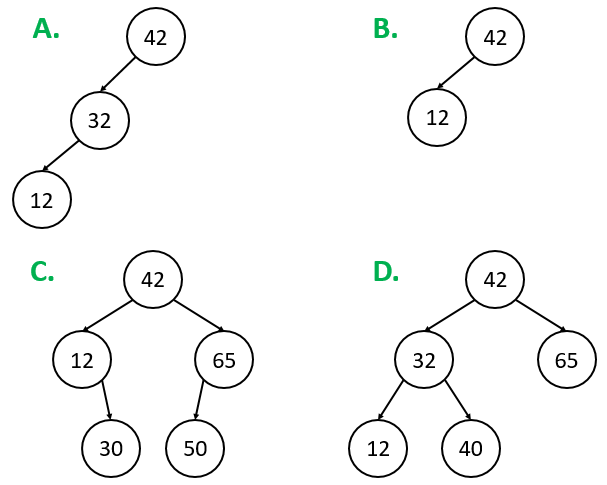
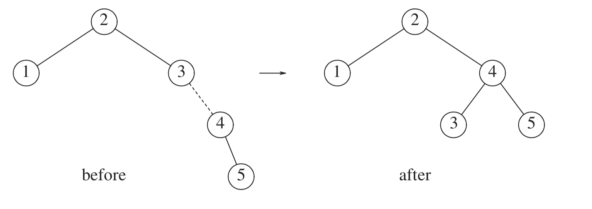
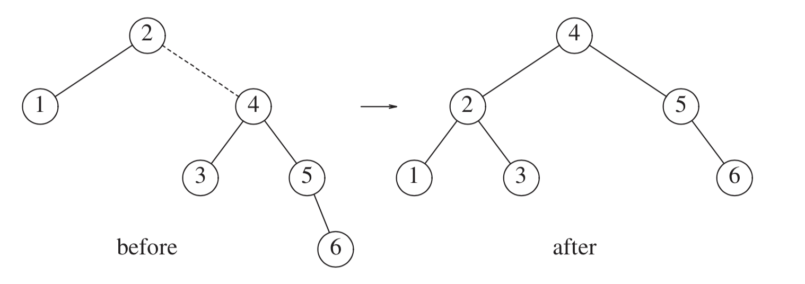
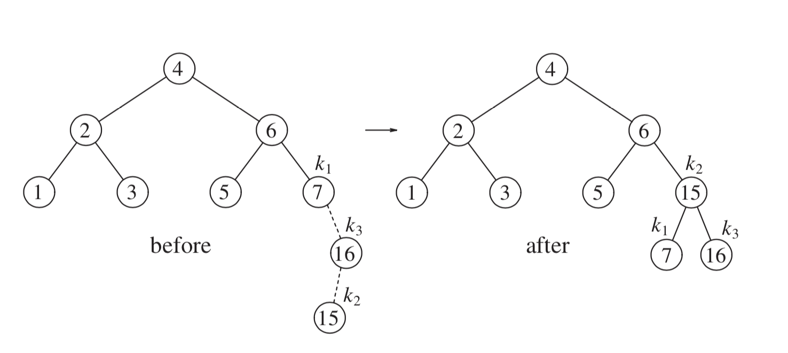
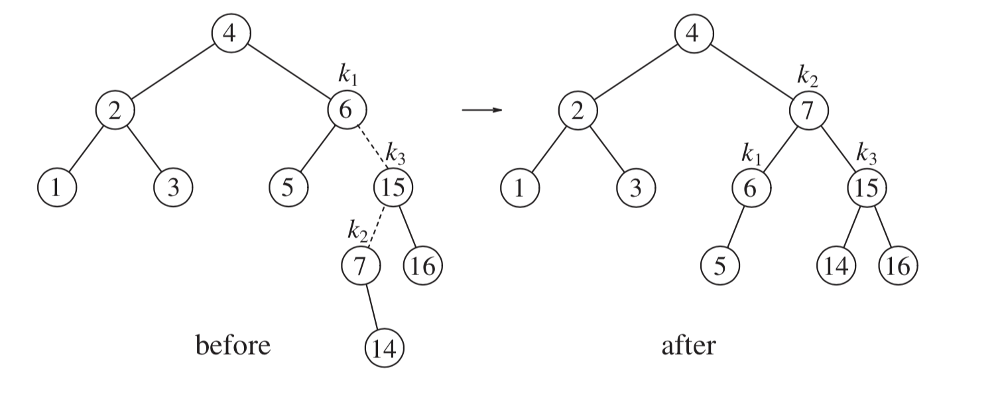
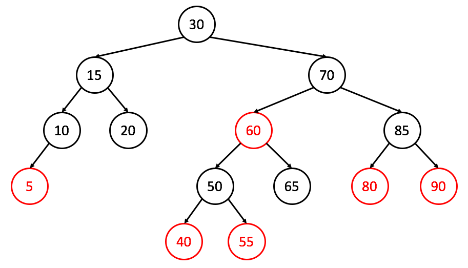
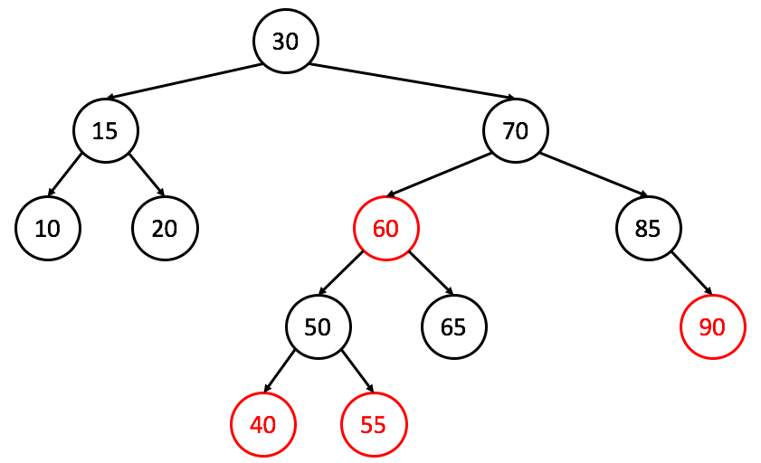

# Rebalancing Binary Search Trees
### Chapters 4 and 12 of _Data Structures and Algorithm Analysis in C++_

## (Partially) Implementing a Binary Search Tree

Last lecture, we talked about the concepts underlying a binary search tree. This
lecture, we'll implement some features (and you'll do the rest in your PA!)

Firstly, let's define our class. Our in-class BST will only hold integers, though your PA uses templates.

We'll define our methods as `virtual`, so that we can do subtyping in the future if we choose (hint hint);
```cpp
class BST {
  struct BSTNode {
    int element;
    BSTNode *left, *right;
    int height;
    BSTNode(int el, BSTNode *lt = nullptr, BSTNode *rt = nullptr) : element(el), left(lt), right(rt) {
      this->height = 0;
    }
    ~BSTNode(void) { }
  };
  BSTNode *root;
  virtual int height(BSTNode *t) const;
  virtual void balance(BSTNode *& t);
  virtual void insert(const int x, BSTNode *& t);
  virtual BSTNode * find_min_rec(BSTNode *t) const;
  virtual BSTNode * find_min_iter(BSTNode *t) const;
  virtual bool contains(const int x, BSTNode *t) const;
 public:
  BST(void);
  virtual ~BST(void);

  virtual const int find_min(void) const;
  virtual bool contains(const int x) const;
  virtual void insert(const int x);

  // other private and public methods omitted
  // that's for you to do in your PA :)
};
```

Great! Any questions about our class as we've defined it so far?

Let's start by implementing the private methods one by one. We'll go in order from top to bottom.
```cpp
int BST::height(BSTNode *t) const {
  return (t) ? t->height : -1; // null node has height -1
}
void BST::balance(BSTNode *& t) {
  if(!t) return; // base case
  t->height = std::max(height(t->left), height(t->right)) + 1;
}
```
These are two pretty simple helper methods, but we need these to do `insert`. Speaking of which, how do we approach `insert`?
```cpp
void BST::insert(const int x, BSTNode *& t) {
  // base case
  if(!t) {
    t = new BSTNode(x); // why does this work?
  } else if(x < t->element) {
    insert(x, t->left);
  } else if(t->element < x) {
    insert(x, t->right);
  }

  // set height
  this->balance(t);
}
void BST::insert(const int x) {
  this->insert(x, this->root);
}
```
Does this insert implementation work?

Next, constructor and destructor:
```cpp
BST::BST(void) : root(nullptr) { }
BST::~BST(void) {
  this->empty(); // empty and 1 arg empty omitted
}
```
Easy enough, eh? Let's do the `find_min` functions next:
```cpp
// this is given in your PA
const int BST::find_min(void) const {
  if(this->root) return this->find_min_rec(this->root)->element;
  else throw std::out_of_range("Tree has no elements.");
}
BSTNode * BST::find_min_rec(BSTNode *t) const {
  // smallest is found by going left
  if(!t->left) return t;
  return find_min_rec(t->left);
}
BSTNode * BST::find_min_iter(BSTNode *t) const {
  // smallest is found by going left
  while(t->left) t = t->left;
  return t;
}
```
As you can see, this function is pretty straight forward both iteratively and recursively.

As a fun fact, the recursive one would (if compiled with optimizations on) get turned into the iterative one by the compiler due to [*tail call optimization*](https://en.wikipedia.org/wiki/Tail_call), but that is a subject for a programming languages course or a compilers course :)

Next up, we'll do the pair of `contains` functions:
```cpp
bool BST::contains(const int x, BSTNode *t) const {
  if(!t) return false; // base case
  if(/* what goes here? */) return this->contains(x, /* what goes here? */);
  if(/* what goes here? */) return this->contains(x, /* what goes here? */);
  return true;
}
bool BST::contains(const int x) const {
  return this->contains(x, this->root);
}
```

## Problems with BSTs
What's the one biggest problem we have in our code above?

Consider the tree created by running our insert function with the following input (in order):

1, 2, 3, 4, 5, 6, 7

1. What is the shape of this tree? <!-- correct answer: diagonal line -->

How about this input (in order):
4, 2, 1, 3, 6, 5, 7

1. What is the shape of this tree <!-- correct answer: perfectly balanced -->

**In a naïve implementation, the tree can get so skewed due to insertion order that we end up with horrible runtimes (`O(n)`) again**.
## Options To Resolve
The key here is that we need to verify that our trees stay balanced throughout. The easiest way to handle this is to **rebalance** the tree as we insert to maintain some standard.

We'll now discuss two commonly used methods, as well as go over some specialty trees that accomplish the same effect for different purposes.

#### AVL Trees
* An AVL (Adelson-Velsky and Landis) tree is a standard BST with an extra **balance constraint**
  * In an AVL tree, the difference in height of the left and right subtrees of ANY node must be no greater than 1.


Which of these is not a valid AVL tree?
<!-- answer: A -->

* To maintain this balanced property, we have to make modifications to insert and remove. Specifically, we need to re-order the tree when balance is violated.
* There are four main **rotations** we can perform on a node to rebalance it:
  1. **Rotate left**
      * Used if the tree is *right-heavy*.
      * 
  2. **Rotate right**
      * Used if the tree is *left-heavy*.
      * 
  3. **Double left**
      * Used if the tree is *right-heavy*, but the right subtree is *left-heavy*
      * Perform a right rotate on the left subtree, then a left rotate on the out of balance node.
      * 
  4. **Double right**
      * used if the tree is *left-heavy*, but the right subtree is *right-heavy*.
      * Perform a left rotate on the right subtree, then a right rotate on the out of balance node.
      * 
* We perform these rotations as needed when inserting and removing nodes to guarantee that our tree will remain as balanced as possible, ensuring `O(log n)` time for all three main operations.

<br><br>
Try doing AVL insertion for [1,7] in that order. What shape do you get?
<br><br>
<!-- should be the same shape as [1,7] with the weird order in regular BST -->

* Downside of AVL: they're not super fast for inserting and usually require another pass through to verify the balance constraint.

#### Red-Black Trees
* First conceptualized in 1972 by Bayer, but the modern implementation first appeared in 1978 by Guibas and Sedgewick.
* The tree trades strict balancing for speed, while still maintaining the logarithmic properties for all operations.
* A Red-Black tree is a BST for which the following properties must hold:
  1. All nodes are either "red" or "black" colored.
  2. The root must be "black".
  3. If a node is "red", it must not have any "red" children
  4. For any node *u*, every path from *u* to a null pointer must have the same number of "black" nodes.

Crucially, this means that being an AVL tree is a stricter property than being a Red-Black tree.

Is the following tree both a valid AVL and red-black, or just red-black?


Is the following tree both a valid AVL and red-black, or just red-black?


**_We won't cover insertion or removal into a red-black tree (that's for CSE 100!) but you can read about it [here](http://www.stolerman.net/studies/cs521/red_black_trees.pdf)!_**

**_The book mentions a few more data structures; namely, B trees, B+ trees, and splay trees. We won't cover those here, but feel free to check out chapters 4 and 12 of the book for B trees and splay tree implementations, and read the [original splay tree paper](https://www.cs.cmu.edu/~sleator/papers/self-adjusting.pdf) here! Be warned, it's a hefty paper._**

That's all folks! Good luck on midterm 2, and next time we'll cover [heaps and priority queues (with a special appearance from another BST type)](./heaps_pqs.md).

[back](../lectures.md)
