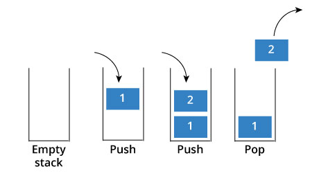

# Stacks and Queues
### Chapter 3 of _Data Structures and Algorithm Analysis in C++_



## The Motivation

Stacks and Queues are ADTs that represent some of the most normally occurring phenomena we see in day to day life.

Examples include:

* Queue lines (obviously)
* Piles of stuff
* Browser history
* Waiting to buy the next pair of Yeezys

## Stacks

Firstly, we'll talk about stacks.

* What: ADT that supports three basic operations: `push`, `pop`, and `top/peek`

* Why: Provides constant time $O(1)$ access to *only* the most recently added element. Allows us to create a history of things in order that they were seen. Follows ordering of __*Last in, First Out*__ (LIFO).

### Use Cases

Let's give some practical coding examples for stacks!

#### Balancing Symbols

Q: Given a string, return `true` if the string has balanced symbols and `false` otherwise.

Examples:

"([{}])" --> `true`

"(hello there)" --> `true`

"{[}]" --> `false`

"General Kenobi" --> `true`

How would you approach this question? Discuss

Solution:

Create a stack. Read characters in. If you see a '(', '[', or a '{', push it onto the stack. When you see one of the closing ones, pop off of the stack and check if you have a matching pair. Once you're done reading the string, check if your stack is empty and return `true` if so. This runs in $O(n)$ time where $n$ is the length of the string.

#### Infix to Postfix

Q: How do you turn something like 1 + 2 * 3 - (4 + 5) into the equivalent postfix?

Examples:

1 + 2 * 3 - (4 + 5) --> 1 2 3 * + 4 5 + -


Solution:

I'll let you think about this one :)

## Queues

Next, queues. Queues are known as __*First in, First out*__ structures (FIFOs), and have many applications from normal waiting to process scheduling by the operating system.

* Queues support `enqueue` (add an item) and `dequeue` (remove an item) operations.

* Queues can be implemented worst case to take linear time for both operations, but it is possible to get constant time `enqueue` and `dequeue`. *How might we do this?*


## C++ Feature: Introduction to Templates

* Often, you don't truly know what you'll be putting into your data structures.
* Templates allow for you to write one set of code that can be used with anything matching the constraints.
* The idea is that the template parameter can be matched with any time at compile time, giving you the ability to write one set of code that will work with new object later on.
* Similar to Java Generics, but better in many ways.

Pros:

* More typesafe than abstract classes
* Help with removing code duplication
* Much better than void pointers
* Lead to simpler UML diagrams.

Cons:
* Can be confusing to use
* Harder to debug
* Take up a lot of extra space in the executable
* Templates must be in the header files completely

*How do we use them?*

### Example Class: A Stack Outline Using Templates

```cpp
#ifndef STACK_HPP
#define STACK_HPP

#include <iostream>
#include <vector>

template <class T>
class stack {
 private:
  std::vector<T> *vec; // The stack itself
 public:

  stack(void) {
    this->vec = new std::vector<T>();
  }

  ~stack(void) {
    delete this->vec;
  }

  bool empty(void); // Check if empty
  size_t size(void) const; // Get size of stack
  T & top(void) const; // Get element at top of stack
  void pop(void); // Remove element from top of stack
  void push(T &); // Insert element at top of stack
}


template <class T>
bool stack<T>::empty(void) {
  return this->vec->size();
}

#endif
```

Some notes:
1. These template classes *must* go in header files! If you want to put the implementation code in a `.cpp` file, you'll need an `#include <filename>.cpp` right above the `#endif`.
2. Everything defined outside of the class must have a `template <class classname>` above it.
3. You would initialize a stack by doing `stack<int> s;` to invoke the constructor.


That's all folks! Next time, [Linked Lists](./linkedlists.md)

[back](../lectures.md)
