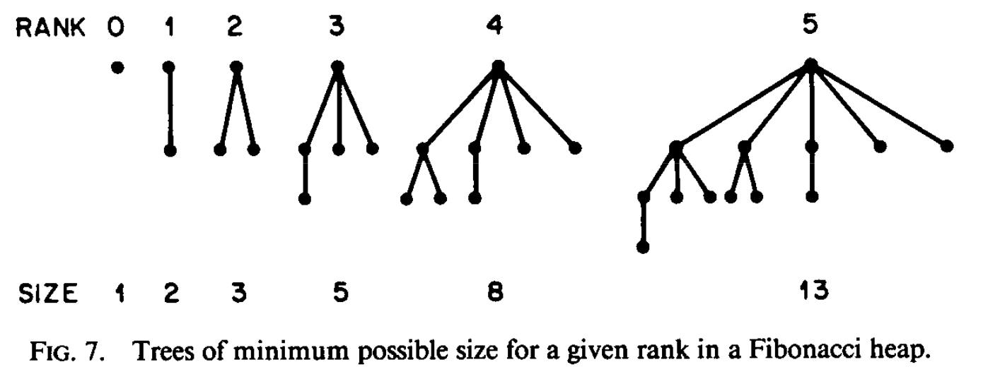

[Assignments](assignments.md) • [Schedule](schedule.md) • [Lectures Notes](lectures.md) • [Staff](staff.md)

## Overview
Welcome! This course aims to provide a broad overview into the basic data structures
that are a crucial part to the development of computer science fundamentals. We will
explore implementation details in C++, as well as discuss features and
techniques of ADTs and data structures informally. 

## Grading Breakdown

**Programming Assignments (40%)**: There will be 7 programming assignments of varying length and difficulty.
Turnin instructions will be posted with the assignments. Do note that you have a _total_ of **4 late days**
that can be used as needed throughout the quarter, with one late day defined as turning in the assignment anywhere from
1 second to 23 hours, 59 minutes, and 59 seconds past the deadline.

**Exams (60%)**: There are two midterms (one week 5 and the other week 8) and a final exam. For both midterms, a one-sided
study sheet is allowed, with the final allowing for a two-sided sheet. Maximum sheet size is 8.5" x 11". This percentage will be calculated in one of three ways, whichever is highest:
1. midterm 1 (15%) + midterm 2 (15%) + final (30%)
2. drop one midterm + midterm (30%) + final (30%)
3. drop one midterm + midterm (15%) + final (45%)

_Extra credit may be awarded to students who are top contributors on Piazza and in lecture, as determined at the discretion of the course staff._

## Resources

* [Data Structure Visualizations](https://www.cs.usfca.edu/~galles/visualization/Algorithms.html)
* [_Data Structures and Algorithm Analysis in C++_, by Mark Allen Weiss](http://iips.icci.edu.iq/images/exam/DataStructuresAndAlgorithmAnalysisInCpp_2014.pdf)
* [Runtime Cheat Sheet](http://bigocheatsheet.com/)