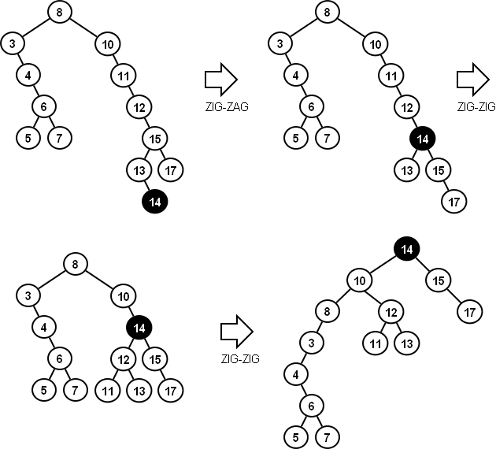

# Style Guide for CSE 12

The style guide for this class is largely based on the [Google C++ Style Guide](https://google.github.io/styleguide/cppguide.html),
with a few modifications/simplifications. In general though, you can just follow what it says to do.

### Header Files
  * In general, you should include C library header files first, then C++ library headers, other library header files
    (not relevant for this class), and lastly the header files for this project.
  * You can `inline` getter and setter functions, though you don't have to.
  * Don't use external libraries unless told to (so no usage of `boost`).

### Classes
1. Structs vs Classes
  * Use structs only for passive objects that carry data, but use classes for everything else.
  * For functors, you can use structs (probably won't be relevant for this course).
2. Inheritance
  * We'll prefer composition over inheritance, but only do `public` derivations if inheritance is being used.
  * If you need a `private` derivation, just use composition.
3. Operator Overloading
  * Use it. It's good.
  * For classes we write, we'll tell you which operators to overload.
4. `public`, `private`, `protected`
  * The code should be two spaces, but the keyword itself should be one space indented.
      use [this link](https://google.github.io/styleguide/cppguide.html#Class_Format) as an example.

### Formatting
5. Tabs vs Spaces
  * Use spaces. 2 or 4 spaces is fine (2 preferred) but absolutely no tabs.
  * Set up your editor to replace tabs with spaces.
6. Line Length
  * Keep your lines no more than 80 chars long. There are a few exceptions; [read them here](https://google.github.io/styleguide/cppguide.html#Line_Length)
7. Function Declarations and Definitions
  * Put them all on the same line, if they fit.
  * If it doesn't fit, refer to [this link](https://google.github.io/styleguide/cppguide.html#Function_Declarations_and_Definitions).
8. Function Calls
  * Refer to [this link](https://google.github.io/styleguide/cppguide.html#Function_Calls).
9.  Conditionals
  * Refer to [this link](https://google.github.io/styleguide/cppguide.html#Conditionals), except that it's fine to do `if(condition)` without the space after the `if`.
10. Loops and Switch Statements
  * [This link](https://google.github.io/styleguide/cppguide.html#Loops_and_Switch_Statements) will be your friend here. Just don't put blank bodies of code.
11. Pointer and References
  * Don't put spaces around the period or arrow, and don't put trailing spaces after the pointer.

### Naming
12. Constants/Macros
  * These should be UPPER_SNAKE_CASE.
13. Variable Names
  * Like file names, these should be snake_case. Don't use lowerCamelCase
14. Namespaces
  * These should be all lowercase (e.g. `std::` and `test_utils`)

### Comments
15. File Headers
  * Every file needs a header containing name, account number, date, assignment number, sources of help, and a short description. The formatting can be however you want, though. 
16. Class Headers
  * Every class needs a header explaining the usage, methods, and purpose. Formatting can be however you want as long as all of the information is present and it doesn't look bad.
17. Commenting in Methods
  * Avoid overcommenting. Make sure you comment big ideas as well as particularly confusing bits of your code, but assume your reader understands advanced C++ (cause they do) so you don't need to comment bits like `x++`.